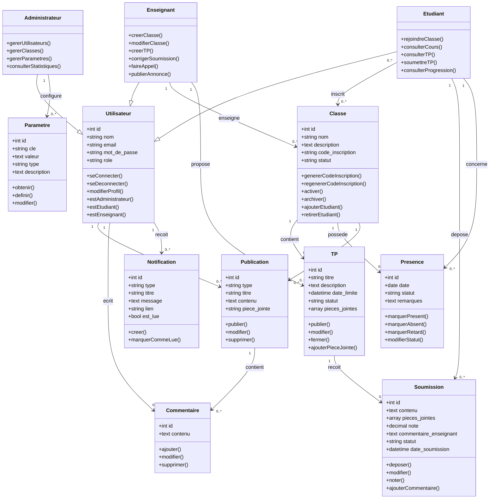

# Diagramme de Classes

Ce diagramme présente les principales classes du système de gestion des TP.

Les classes `Administrateur`, `Etudiant` et `Enseignant` sont représentées comme des spécialisations de la classe `Utilisateur`. Dans l'implémentation Laravel, ces rôles sont stockés dans l'attribut `role` de la table `users`.

## Description

Le diagramme montre les classes principales du système et leurs relations. `Utilisateur` est la classe générale utilisée pour l'authentification. Les classes `Administrateur`, `Etudiant` et `Enseignant` héritent de `Utilisateur` afin de représenter les différents rôles du système.

Une `Classe` est créée et gérée par un `Enseignant`. Un `Etudiant` peut être inscrit dans plusieurs classes. Une classe contient plusieurs `TP`, et chaque TP peut recevoir plusieurs `Soumission`. Le suivi des présences est représenté par la classe `Presence`.

Les classes `Publication`, `Commentaire` et `Notification` représentent la partie communication du système. La classe `Parametre` représente les paramètres généraux configurés par l'administrateur.
