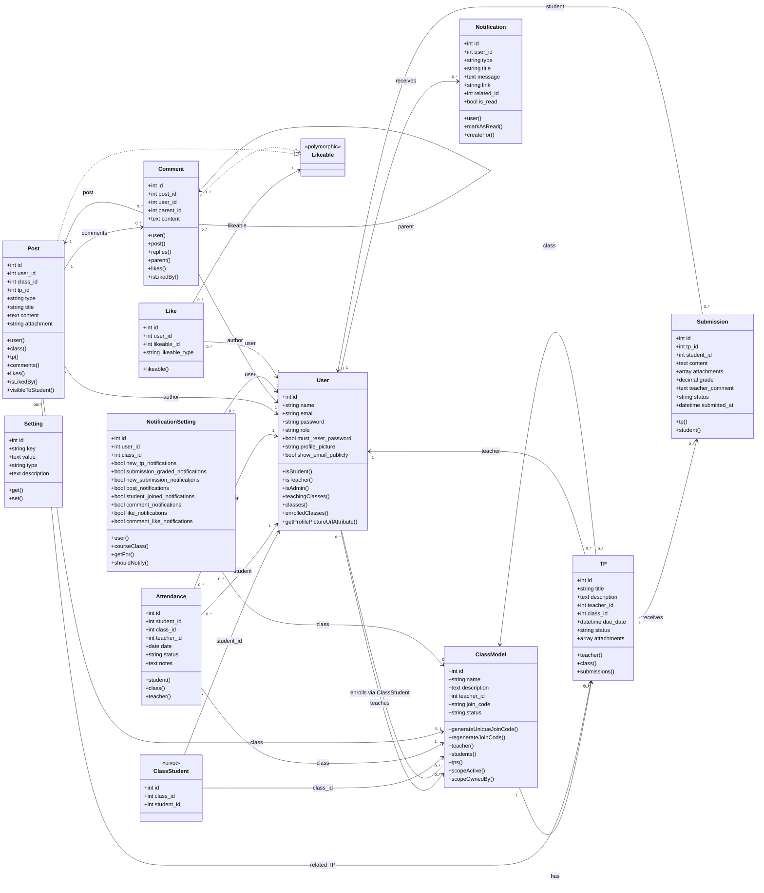

# Class Diagram

This project uses **Mermaid** for the class diagram.

Mermaid is the best fit for this repository because it is text-based, easy to maintain in Git, renders directly in many Markdown viewers, and does not require extra tooling such as Java, Graphviz, or a UML desktop application.

## Scope

This diagram focuses on the domain and persistence layer in `app/Models`. Controllers, mail classes, providers, and views are not included because they would make the diagram harder to read without adding much value to the core data model.
